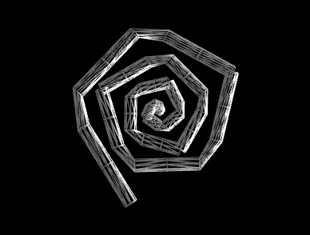

## Synthèse d’Image - Polytech Grenoble, INFO4, 2024-2025 

## TP6: Tessellation et Courbes de Bézier

{height=150}{height=150}{height=150}
à gauche: un tube (rendu filaire) autour d'un polygone. au milieu: un tube (rendu plein) autour des courbes de Bézier de degré 3 définies par les mêmes sommets. à droite: les sommets ont été modifiés pour rendre la courbe C1

## Introduction
L’objectif du TP est de s’initier à la tessellation et d'implémenter l'algorithme de De Casteljau pour l'évaluation de courbes de Bézier.
La base de code qui vous est fournie reprend les éléments des précédents TPs : création de fenêtre GLFW et initialisation de contexte OpenGL, affichage de géométrie, et utilisation des matrices de transformation pour manipuler la scène. Si ce n'est pas déjà fait, placez cette base de code dans votre dossier ```TP3D``` contenant les TPs.

- accédez au dossier des TPs: ```cd ~/TP3D/```
- placez vous dans le répertoire TP3: ```cd TP6```


- créez un dossier pour la compilation, accédez à ce dossier, lancez CMake, lancez la compilation
```
mkdir build
cd build
cmake ..
make
```

Vous pouvez alors exécuter le programme:

```
./si_info4
```
## Tessellation

Outre les shaders de sommet (`vertex shader`) et de fragment (`fragment shader`) que vous avez utilisé dans les TPs précédents, il est possible de programmer des shaders de tessellation et de géométrie. Ces shaders prennent place entre les shaders de sommet et de fragment, et ont pour but de générer des primitives, le plus souvent des segments et des triangles, à partir de la sortie du shader de sommet, et de les transmettre à l'étape de rasterisation puis au shader de fragment.

Comme illustré dans l'image suivante extraite du [wiki OpenGL](https://www.khronos.org/opengl/wiki/tessellation) il existe trois types de tessellation en OpenGL: 

{height=100} {height=100}{height=100}

##### Tessellation control shader
Un premier shader, appellé le `tessellation control shader`, détermine le nombre de sommets le long des bords et à l'intérieur. Une utilisation classique du control shader consiste à utiliser plus de sommets lorsque la taille de la primitive à l'écran est grande. Dans le code qui vous est fourni le tessellation control shader est écrit dans le fichier `tessellation_02_cont.glsl`. Le nombre de sommets le long des bords et à l'intérieur est constant, et est déterminé par les lignes suivantes: 
```
	gl_TessLevelOuter[0 ou 1, 2, 3] = 8.0f;
	gl_TessLevelInner[0 ou 1] = 8.0f;
```
Vous pouvez modifier temporairement ces valeurs et observer le résultat.
C'est un control shader trivial. Dans des applications réelles le nombre de sommets dépendra des données transmises par le vertex shader, et une des difficultés consiste à assurer que lorsque deux primitives tessellées partagent un même bord, ce bord commun sera tessellé avec le même nombre de sommets dans les deux primitives, sinon des discontinuités apparaitront entre les primitives.

##### Tessellation evaluation shader
Le deuxième shader, appellé le `tessellation evaluation shader`, doit calculer la position des sommets.
La ligne suivante indique le type de tessellation, ici celle découpant des patchs quadrilatères
```
layout(quads, fractional_even_spacing) in;
```
Vous pouvez remplacer temporairement `quads` par `triangles` et observer le résultat.
Pour calculer la position des sommets vous disposez de deux type d'informations: les sommets qui vous ont été transmis par le vertex shader, auquel vous accédez par `controlPoints[i].gl_Position`, et deux coordonnées paramétriques `gl_TessCoord.x, gl_TessCoord.y`. Pour la tessellation des quads, les coordonnées paramétriques varient entre 0 et 1 comme indiqué dans la figure suivante:
{height=150}

Vous allez devoir calculer des points sur un tube autour d'une courbe de Bézier. La figure suivante indique comment calculer des points sur un tube autour d'une courbe centrale. 
{height=150}
$P$ est un point sur la courbe. $t$ est un vecteur normé portant la tangente, $b$ et $n$ sont deux vecteurs dans le plan orthogonal à $t$. Le point $Q$ est calculé par la formule suivante: $Q = P + r \left( n \text{ cos}(\theta) + b \text{ sin}(\theta)\right)$, où $r$ est le rayon du tube. Dans le code qui vous est fourni, $P$ est noté `pointSurLaCourbe`, et c'est un point qui parcours un polygone quand la coordonnée $x$ de tessellation varie entre $0$ et $1$. $t$ est noté `tangenteCourbe` et, toujours dans la version qui vous est fournie, il est égal à un vecteur normé le long de l'arête sur laquelle se trouve le point $P$.
Vous pouvez modifier temporairement la valeur de $r$ qui est noté `rayonTube` dans le code et observer le résultat.

##### Geometry shader

La dernière étape avant la rasterisation est un `Geometry Shader` qui calcule les primitives finales. Il est écrit dans le fichier `tessellation_04_geom.glsl`. Ce shader reçoit en entrée les primitives qui ont été produites par la tessellation. Ce sont des triangles dans notre code. En sortie le shader va soit recopier ces triangles, soit ne produire que les arêtes des triangles. Par défaut ce sont les arêtes qui sont transmises au rasteriser. Pour transmettre les triangles, il vous faut commenter la ligne suivante:
```
layout(line_strip, max_vertices = 4) out;
```

et décommenter la ligne suivante:

```
// layout(triangle_strip, max_vertices = 3) out;
```
Faites le et observez le résultat.

###### Travail à réaliser:

Vous devez modifier le calcul de `pointSurLaCourbe` et de `tangenteCourbe` dans le fichier `tessellation_03_eval.glsl` pour calculer par l'algorithme de De Casteljau le point de paramètre `x` sur la courbe de Bézier définie par les points de contrôle `b[0],b[1],b[2],b[3]`, ainsi que la tangente à la courbe en ce point.

###### Travail à réaliser:

Dans le code C++ `main.cpp`, les sommets de la spirale sont stockés dans un tableau `MesSommets` qui est calculé dans les lignes 80 à 87.
Quels sont les indices des sommets qui se trouvent au raccord entre les courbes de Bézier?

Modifiez tous les sommets `MesSommets[i]` pour les indices `i` correspondant aux raccords entre les courbes de Bézier, en les remplaçant par le milieu des sommets `MesSommet[i-1]` et `MesSommet[i+1]`. Cela assure que la condition de continuité C1 est vérifiée. 


