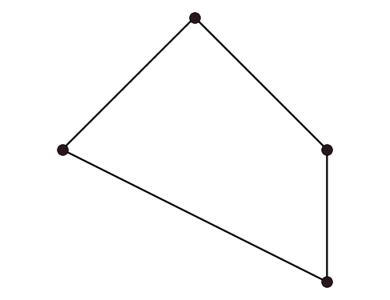
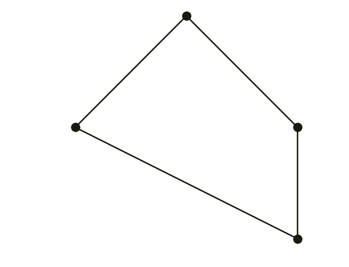

# TP7: Subdivision Curves

A subdivision curve is defined as the limit of recursive refinement of the input polyline $(x_i^0)$

. Your today’s task is to implement three curve subdivision schemes from the lecture. For the sake of simplicity, we’ll be working with closed curves only.

Generally, one iteration of curve subdivision has the following form:

* Topological step: curve is upsampled by inserting a new vertex between each two adjacent vertices. This doubles the number of vertices: if there were $n$ vertices, now there is $2n$ of them.
* Geometric step: new positions are computed for all vertices.

#### Chaikin’s scheme

Introduced in 1974 by George Chaikin, this algorithm revolutionized the world of numerical geometry. Limit curve is a uniform quadratic B-spline, therefore it is $C^1$ continuous.
$$
x_{2i}^{n+1} = {3\over 4} x_i^n + {1\over 4} x_{i+1}^n \\
x_{2i+1}^{n+1} = {1\over 4} x_i^n + {3\over 4} x_{i+1}^n
$$

#### Corner-cutting

Generalization of Chaikin’s algorithm with two parameters $0<a<b<1$:
$$
x_{2i}^{n+1} = (1-a) x_i^n + a x_{i+1}^n \\
x_{2i+1}^{n+1} = (1-b) x_i^n + b x_{i+1}^n
$$

Setting $a=0.25,b=0.75$ gives Chaikin. The following example uses $a=0.1,b=0.6$:

#### Four-point

Unlike corner cutting, the four-point scheme is interpolatory.

$$
x_{2i}^{n+1} =  x_i^n  \\
x_{2i+1}^{n+1} = {1\over 16} \left(-x_{i-1}^n + 9 x_i^n + 9 x_{i+1}^n - x_{i+2}^n\right)
$$

#### TODO

* Implement the three subdivision schemes.
* Experiment with different values of $a,b$ in corner cutting. Specifically, try using
$$
b = a + {1/2}\\ 
b \neq a + {1/2}
$$
What do you observe?
* Generalized four-point uses the mask $[−\omega,1/2+\omega,1/2+\omega,−\omega]$ ($\omega=1/16$ in the original scheme). Modify your implementation of this algorithm to account for the tension parameter ω and try varying its value.