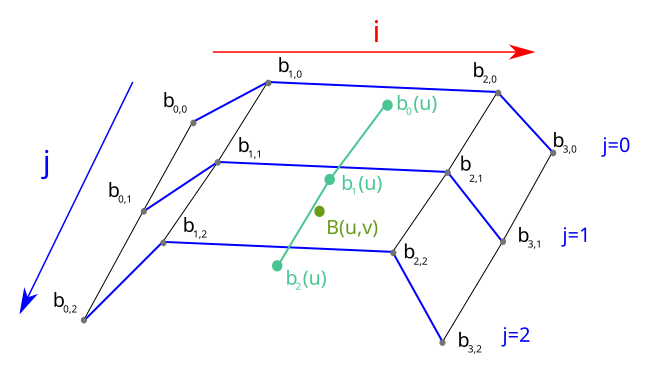
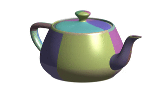
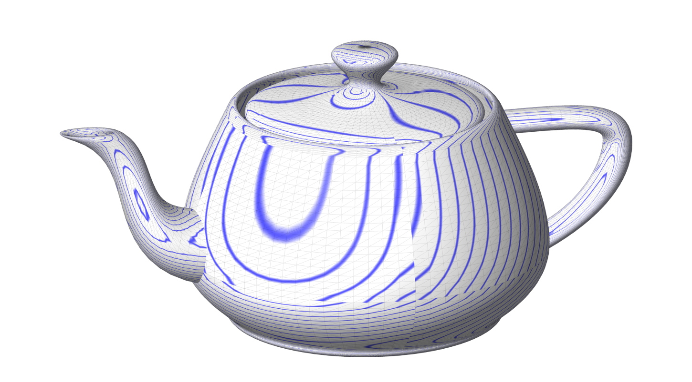

# TP8 : Bezier surfaces
---

## Tensor-product Bézier surfaces
Tensor product Bézier surfaces are a direct generalization of Bézier curves.
Instead of a control polygon $\mathbf b_i$, we consider a control net $\mathbf b_{ij}$.
A Bézier surface is the described as

$$
S(u,v) = \sum_{i=0}^{m} \sum_{j=0}^{n} \mathbf b_{ij} B_{i}^{m}(u) B_{j}^{n}(v)
$$

where $m,n$ are degrees in $u,v$, respectively; $B_{l}^{k}$ are Bernstein polynomials.


## Evaluation
To evaluate a point $S(u,v)$ on a surface, let's fix $j$ and vary $i$.

$$
\displaystyle B(u,v) = 
\sum_{j=0}^{n} 
B_{j}^{n}(v)
\underset{= \mathbf b_{j}(u) }
{
\underbrace{
\left[
\sum_{i=0}^{m} 
\mathbf b_{ij} 
B_{i}^{m}(u) 
\right]
}
}
$$

The $\mathbf b_{j}(u)$ defines a Bézier curve in $u$ and can be evaluated using the De Casteljau algorithm.

$$
\displaystyle B(u,v) = 
\sum_{j=0}^{n} 
\mathbf b_{j}(u)B_{j}^{n}(v)
$$

This equation defines a Bézier curve in $v$ with control points $\mathbf b_{j}(u)$ depending on $u$. At the end of the day, we have

* $n+1$ evaluations of the De Casteljau for the degree $m$;
* $1$ evaluation of the De Casteljau for the degree $n$.

Alternatively, we can fix $i$ and vary $j$.



Bézier patch evaluation scheme.


## Coordinate matrices
In the code, the control points $\mathbf b_{ij}$ are actually stored in three coordinate matrices $\texttt{Mx}, \texttt{My}, \texttt{Mz} \; $ so that

$$
\mathbf b_{ij}^x = \texttt{Mx(i,j)}, \qquad
\mathbf b_{ij}^y = \texttt{My(i,j)}, \qquad
\mathbf b_{ij}^z = \texttt{Mz(i,j)}.
$$

This means the code is more comprehensible as the structure of the matrices directly represents the grid topology of the patch. On the other hand, it also means the computation needs to be done for each coordinate individually.


## Bézier surface vs. piecewise Bézier surface

In practice, a Bézier surface often consists of multiple surface *patches*, each having its own control polygon.
Therefore, it is sometimes called a *piecewise* Bézier surface.

Some surfaces in the `data/` folder consist of more than one patch, ranging from 2 (heart) to 32 (teapot).
They are saved in the BPT format; some datafiles are taken from the website of [Ryan Holmes](http://www.holmes3d.net/graphics/roffview/tools/patchoff/) where you'll also find more details about this format in case you're interested.


{height=150} {height=150}

The discontinuity in isophotes shows the piecewise Bézier Utah teapot is not $\mathcal C^1$.

## ToDo

1. Implement the evaluation of Bézier surfaces for $(u,v) \in [0,1]^2$. 
Use `simple` and `wave` for first tests (these contain only one patch).
2. When you're sure the implementation works for the simple cases, test your algorithm on datasets with multiple patches:
`heart` (2),  `sphere` (8),  `teapot` (32), `teacup` (26), `teaspoon` (16). Don't set the `density` parameter too high, always start with smaller values (5 or 10) as the number of computed points is `density`².

---

## Working with 3D surfaces 

### OpenGL Viewer setup
Today, we will work with surfaces, which means transition from 2D to 3D. 
We will use OpenGL for rendering. A wrapper class `Viewer` is provided for this. 
Adding a surface patch is as easy as calling
```python
viewer.add_patch(X,Y,Z)
```

First you can test if you have all required packages and test the viewer with
```
# test the viewer
python viewer/viewer.py
```

If you do not see a window appearing, (if you are using your own computer) you need to setup the required python packages `PyOpenGL` `GLFW` and `PyGLFW`. 

Afterwards, you can test the viewer with
```
# test the viewer
python viewer/viewer.py
```

### Alternative Viewer: Using matplotlib
```python
import matplotlib.pyplot as plt
from mpl_toolkits.mplot3d import Axes3D
fig = plt.figure()
ax = fig.add_subplot(111,projection='3d')
ax.axis('off')
...

for p in range(numpatch) :
    ...
    ax.plot_wireframe(X, Y, Z)
    ...

# max and minimum range can be computed with the ptp function
lim = ax.get_w_lims()
ax.set_box_aspect((lim[1]-lim[0],lim[3]-lim[2],lim[5]-lim[4]))

plt.show()
```

---
## Base code

For the TP8, you can pass datanames and density directly as command line args.

Try the base code:
```
python tp8.py  [simple,wave,sphere,heart,teapot,teacup,teaspoon]  [density=10]
```

### Representation
On the implementation level, the biggest difference between curves and surfaces is the representation we'll use.
Before, we used a single matrix to represent the whole curve -- each coordinate was stored in a separate column.
For surfaces, we could do something similar using three-dimensional arrays; instead, to facilitate understanding of the code, we'll represent the three coordinates in separate matrices `Mx`, `My` and `Mz` (or `Sx`, `Sy`, `Sz` for surface points).

### Functions to modify
* `DeCasteljau` : implement the De Casteljau algorithm for surfaces.
* `BezierSurf` : compute Bezier surface points.
